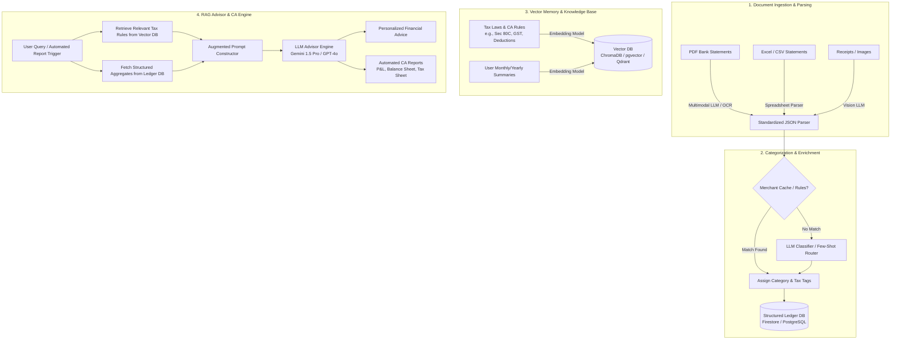
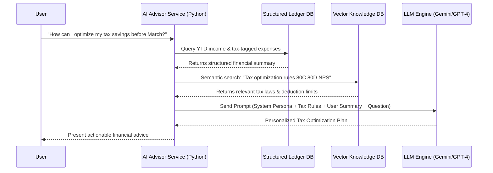

# RAG-Based AI Financial Advisor & Virtual CA: Comprehensive Architecture & Step-by-Step Implementation Guide

This guide outlines the end-to-end technical architecture, system design, and implementation roadmap for building an AI-powered financial system capable of automatically ingesting bank statements (PDFs, Excel/CSV), categorizing transactions, tracking historical financial health, providing personalized financial advice, and automating Chartered Accountant (CA) workflows within **SmartLedger**.

---

## 1. Executive Summary & Architecture Overview

The system combines **Multimodal Document Parsing**, **Structured Ledger Storage**, and **Retrieval-Augmented Generation (RAG)** to transform raw financial documents into actionable insights and automated tax/accounting reports.



---

## 2. Phase 1: Multi-Format Document Ingestion & Parsing

### 2.1 Handling PDF Bank & Credit Card Statements
Bank statements come in hundreds of layout variations, making regex or simple OCR fragile.
*   **Recommended Approach — Multimodal LLMs (Gemini 1.5 Pro / GPT-4o):** Modern vision-language models can ingest entire PDF documents (up to hundreds of pages via large context windows) and extract tabular transaction data with high fidelity.
*   **Fallback Approach — Dedicated OCR:** AWS Textract (Tables feature) or Google Cloud Document AI for high-volume deterministic extraction.

### 2.2 Handling Excel / CSV Spreadsheets
*   Use robust spreadsheet parsers (`pandas`, `openpyxl` in Python or Apache POI in Java) to map variable column headers (`Txn Date`, `Value Date`, `Narration`, `Withdrawal`, `Deposit`, `Balance`) into a unified schema.

### 2.3 Standardized Transaction Schema
Every parsed document must be converted into a standardized JSON array before entering the processing pipeline:

```json
{
  "transactionId": "txn_20260729_0001",
  "sourceDocument": "HDFC_Statement_June2026.pdf",
  "date": "2026-06-15",
  "descriptionRaw": "POS*ZOMATO*NEW DELHI*IN",
  "descriptionClean": "Zomato",
  "amount": 485.50,
  "type": "DEBIT",
  "currency": "INR",
  "accountReference": "XXXX-1234",
  "balanceAfterTxn": 145230.00
}
```

---

## 3. Phase 2: Expense Categorization & Enrichment Engine

### 3.1 Two-Tier Hybrid Categorization
To optimize API latency and reduce LLM token costs, implement a two-tier router:
1.  **Tier 1: Deterministic Merchant Cache (Redis / DB Lookup):**
    *   Maintain a mapping table of known merchant signatures (`ZOMATO`, `SWIGGY` -> `Food & Dining`; `UBER`, `OLA` -> `Transport`; `LIC`, `HDFC LIFE` -> `Insurance / 80C`).
2.  **Tier 2: LLM Few-Shot Categorization Router:**
    *   If the description is not in the cache, pass it to an LLM with structured JSON output enabled.

### 3.2 Tax & Compliance Tagging (The CA Layer)
During categorization, enrich each transaction with tax-related metadata:
*   `isTaxDeductible`: Boolean flag.
*   `deductionSection`: Relevant tax law section (e.g., `80C`, `80D`, `80G`, `Business Expense`, `GST Input Credit`).
*   `expenseNature`: `Personal`, `Business`, or `Capital Expenditure`.

---

## 4. Phase 3: Database & Vector Storage Architecture (The RAG Core)

### 4.1 Why Dual Databases are Required
*   **Structured Ledger DB (Firestore / PostgreSQL):** Essential for exact mathematical aggregations (e.g., *Total spent on rent in Q2 = ₹1,20,000*). LLMs should **never** be used to calculate sums over raw text.
*   **Vector Database (ChromaDB / Qdrant / pgvector):** Essential for semantic search over unstructured knowledge and historical context.

### 4.2 What to Store in the Vector Database
1.  **Statutory Knowledge Base:**
    *   Index official tax documentation, Income Tax slabs, GST rate cards, allowable deduction rules, and CA compliance checklists.
    *   *Example Chunk:* `"Under Section 80D, deduction for medical insurance premium paid for self and family is capped at ₹25,000 for non-senior citizens and ₹50,000 for senior citizens."`
2.  **User Historical Financial Notes & Insights:**
    *   Monthly synthesized summaries generated by the system (e.g., `"In June 2026, user spent 35% of income on discretionary dining, representing a 15% increase over Q1 average."`).

---

## 5. Phase 4: Building the RAG Financial Advisor & Virtual CA

### 5.1 The RAG Execution Pipeline
When a user asks a question or requests a CA report, the system executes a structured workflow:



### 5.2 System Prompt Template for CA Automation
```markdown
You are an expert Chartered Accountant and Personal Financial Advisor.

### RETRIEVED STATUTORY TAX RULES:
{retrieved_tax_rules_from_vector_db}

### USER'S CURRENT YEAR FINANCIAL METRICS (VERIFIED BY SYSTEM):
- Gross Inflow: {total_income}
- Deductions Utilized (Section 80C): {total_80c_spent} (Limit: 150000)
- Health Insurance (Section 80D): {total_80d_spent}
- Top Expense Categories: {category_breakdown_json}

### TASK:
1. Provide mathematically sound tax optimization recommendations based ONLY on the verified financial metrics above.
2. Identify specific deduction gaps where the user can save tax before the end of the financial year.
3. Highlight any spending anomalies or categories growing faster than historical averages.
4. Do not hallucinate tax rules; rely strictly on the retrieved statutory tax rules.
```

---

## 6. Step-by-Step Implementation Roadmap for SmartLedger

### Step 1: Create an AI Python Microservice (FastAPI + LangChain)
*   **Why:** While your core dashboard uses Java Spring Boot, Python is the industry standard for AI orchestration, PDF parsing, and embedding generation.
*   **Action:** Build a lightweight FastAPI service that exposes endpoints for:
    *   `POST /api/ai/parse-document` (Accepts PDF/Excel, returns structured JSON).
    *   `POST /api/ai/categorize` (Enriches transactions with categories & tax flags).
    *   `POST /api/ai/advisor-chat` (Executes the RAG query pipeline).

### Step 2: Implement the Document Parser
*   **Action:** Integrate the Google Gemini 1.5 Pro API (using the `google-generativeai` or `@google/genai` SDK) to handle PDF bank statement extraction.
*   **Validation:** Ensure the parser validates double-entry accounting rules (`Opening Balance + Credits - Debits = Closing Balance`) before committing data.

### Step 3: Populate the Vector Store with Tax & CA Rules
*   **Action:**
    *   Set up an embedded instance of **ChromaDB** or **Qdrant** within your Python service.
    *   Create an ingestion script that converts public Tax Guides, Section 80C/80D/80G rules, and investment FAQs into markdown chunks and indexes them using embeddings (e.g., `text-embedding-004` or `text-embedding-3-small`).

### Step 4: Integrate with SmartLedger's Frontend & Java Backend
*   **Action:**
    *   Add an **"AI CA & Import"** tab in your React `Dashboard.jsx`.
    *   Allow users to drag-and-drop statements; send the file to your Python microservice, preview the extracted transactions in a table, and confirm import into your primary Firestore database.
    *   Add an interactive **"Financial Advisor Chat"** widget where users can ask natural language questions about their expenses, budget forecasts, and tax returns.

---

## 7. Security, Compliance & Privacy Best Practices

1.  **PII Sanitization:** Strip account numbers, social security / PAN / Aadhaar numbers from prompts before sending logs to external monitoring tools.
2.  **Zero Data Retention (ZDR):** When using commercial LLM APIs (like OpenAI or Google Cloud Vertex AI), ensure you are on an enterprise or API tier with explicit **Zero Data Retention** policies so user bank statements are not used for model training.
3.  **Deterministic Audit Trails:** For CA reporting, always show the user the exact line items and transactions that contributed to a calculated tax liability or deduction figure so they can verify the numbers.
